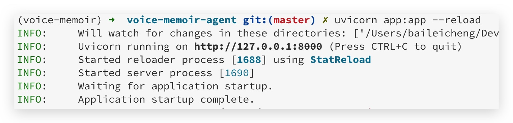
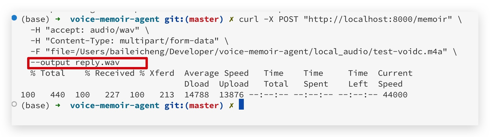

# 🎙️ Voice Memoir Agent

A lightweight AI-powered voice journaling assistant that lets you record memories via speech. The system transcribes, understands, and responds using natural language, while remembering what you've said through semantic search.

## 🧠 Features

- 🎤 **Voice Input**: Upload voice recordings and have them transcribed via OpenAI Whisper (openai-whisper).
- 💬 **AI Conversation**: GPT-4 guides and responds to user memories with context-awareness.
- 🔊 **TTS Reply**: Replies are converted to audio using pyttsx3.
- 🧾 **Semantic Memory**: Stores and retrieves related past memories using FAISS + Embedding.
- ⚡ **FastAPI Backend**: Simple, extendable architecture for demo or production.


## 🗂️ Project Structure

```bash
voice_memoir_agent/
├── app.py               # FastAPI entrypoint
├── whisper_utils.py     # Speech-to-text (openai-whisper)
├── gpt_utils.py         # GPT-4 conversation logic
├── tts_utils.py         # Text-to-speech (pyttsx3)
├── memory_faiss.py      # Memory vector store (FAISS)
└── requirements.txt
````

---

## 🚀 Quickstart (Local)

### 1. Clone repo

```bash
git clone https://github.com/xbfightn/voice-memoir-agent.git
cd voice-memoir-agent
```

### 2. Setup environment (conda recommanded)

- create and activate env:

```bash
  conda create -n voice-memoir python=3.11
  conda activate voice-memoir
```

- instal with conda:

```sh
  conda install -c conda-forge fastapi uvicorn openai faiss-cpu
```

- install with pip:

```sh
  pip install -r requirements.txt
```

---

## 运行

请根据你的项目实际入口文件运行，例如：

```sh
python app.py
```

### 3. Set your OpenAI API key

Edit `gpt_utils.py`:

```python
openai.api_key = "sk-xxxx"
```

### 4. Run the app

```bash
uvicorn app:app --reload
```

#### 效果



### 5. Test with cURL or Postman

```bash
curl -X POST "http://localhost:8000/memoir" \
  -H "accept: audio/wav" \
  -H "Content-Type: multipart/form-data" \
  -F "file=@your_audio.mp3" \
  --output reply.wav
```

#### 效果



---

## 🧰 Tech Stack

| Layer   | Tool                         |
| ------- | ---------------------------- |
| ASR     | OpenAI Whisper (openai-whisper) |
| LLM     | OpenAI GPT-4                 |
| Memory  | SentenceTransformers + FAISS |
| TTS     | pyttsx3                      |
| Backend | FastAPI + Uvicorn            |

---

## 📌 TODOs

* [ ] Frontend: Add React-based voice recording UI
* [ ] Auth: Per-user memory separation
* [ ] Memory persistence: Save FAISS + memory to disk
* [ ] Multilingual support
* [ ] Optional: HuggingFace/LLM local model support

---

## 📄 License

MIT License
